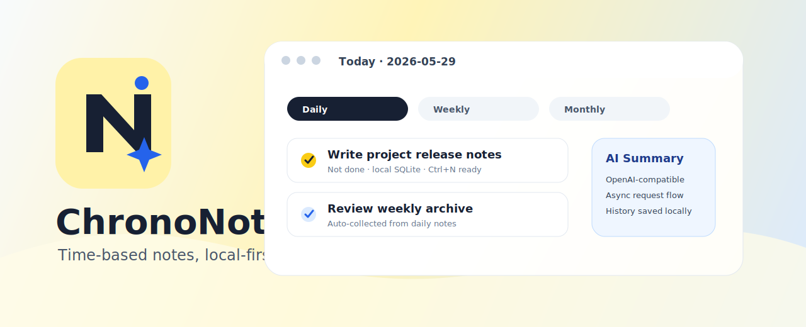
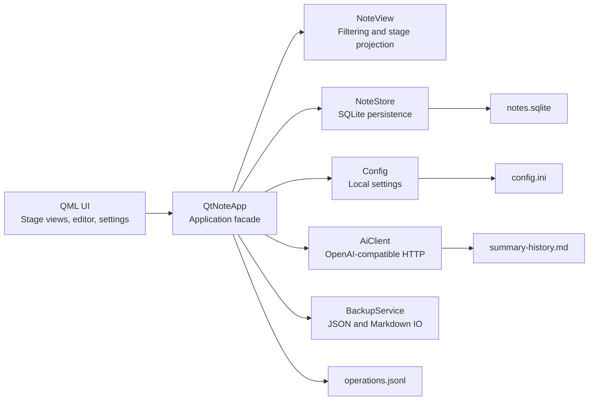

<p align="center">
  
</p>

<h1 align="center">ChronoNotes</h1>

<p align="center">
  A local-first Windows desktop notebook for time-based notes, task capture, and AI-assisted summaries.
</p>

<p align="center">
  
  
  
  
  
</p>

---

**ChronoNotes** 是一款基于 **Qt 6 Quick/QML + C++17** 的本地优先桌面笔记与任务整理工具。它围绕“每天、每周、每月、每年”四类时间阶段组织记录，提供快速输入、搜索筛选、重复任务、导入导出、操作日志和 OpenAI-compatible AI 摘要能力。

它不是协作文档平台，也不是复杂项目管理系统。ChronoNotes 的目标更克制：让个人日常记录足够快、足够清楚、足够可靠，并且默认把数据留在本机。

## 目录

- [核心亮点](#核心亮点)
- [适用场景](#适用场景)
- [功能概览](#功能概览)
- [架构设计](#架构设计)
- [项目结构](#项目结构)
- [快速开始](#快速开始)
- [构建与运行](#构建与运行)
- [验证与测试](#验证与测试)
- [打包发布](#打包发布)
- [数据与隐私](#数据与隐私)
- [AI 摘要配置](#ai-摘要配置)
- [路线图](#路线图)
- [许可](#许可)

## 核心亮点

| 方向 | 说明 |
| --- | --- |
| 本地优先 | 默认使用本地 SQLite 和本地配置文件，不依赖账号系统或云端服务。 |
| 时间阶段 | 以日、周、月、年组织记录，适合任务回顾、阶段复盘和长期积累。 |
| 快速记录 | 支持新增、编辑、完成、删除、取消完成和短时撤销，日常使用不绕路。 |
| 可检索 | 支持跨阶段搜索、完成状态筛选和关键词高亮。 |
| 可迁移 | 支持 JSON 导入/导出和 Markdown 导出，数据不被锁死。 |
| 可扩展 | AI 摘要使用 OpenAI-compatible HTTP 接口，模型与服务地址可配置。 |

## 适用场景

ChronoNotes 适合：

- 管理每天的短任务、临时记录和阶段性事项。
- 每周、每月、每年回看自己做过什么、漏了什么。
- 将零散记录导出为 Markdown 或 JSON，方便归档和迁移。
- 在不引入完整项目管理系统的前提下，保留清晰的本地任务流。
- 使用自定义 OpenAI-compatible 服务生成阶段摘要。

ChronoNotes 不适合：

- 多人实时协作。
- 企业权限、审计、审批流。
- 替代 Notion、Jira、Trello 等大型平台。
- 把所有数据默认交给云端处理。

## 功能概览

### 时间阶段与任务管理

- 每天、每周、每月、每年四类阶段视图。
- 每条记录支持文本内容、完成状态、更新时间和阶段归属。
- 周、月、年视图可聚合每日事项，便于阶段复盘。
- 支持 `daily`、`weekly`、`monthly`、`yearly` 重复规则。
- 支持短时 `Ctrl+Z` 撤销最近一次关键操作。

### 搜索、归档与导入导出

- 跨阶段全文搜索。
- 按完成状态筛选。
- 搜索关键词高亮。
- JSON 导入与导出。
- Markdown 导出，适合长期归档。
- 旧版 `notes.db.txt` 数据首次启动时会迁移到 SQLite。

### AI 摘要

- 支持配置 API URL、API Key 和模型名称。
- 使用 OpenAI-compatible HTTP 接口生成阶段摘要。
- 摘要流程异步执行，避免阻塞主界面。
- 摘要历史写入本地文件，便于后续回看。

### 桌面体验

- Qt Quick/QML 原生桌面界面，不使用 WebView。
- 自绘标题栏。
- 无边框窗口。
- 支持四边与四角拖拽缩放。
- 提供本地项目结构视图，辅助理解工程文件关系。

## 架构设计



| 层级 | 文件 | 职责 |
| --- | --- | --- |
| 启动入口 | `src/qt_main.cpp` | 初始化 Qt 应用、注册类型、加载 QML 模块。 |
| 应用门面 | `src/qt_note_app.cpp` / `src/qt_note_app.h` | 连接 UI、数据、配置、AI、导入导出等模块。 |
| 视图模型 | `src/note_view.cpp` / `src/note_view.h` | 阶段筛选、搜索过滤、展示数据整理。 |
| 数据存储 | `src/note_store.cpp` / `src/note_store.h` | SQLite 持久化、迁移、操作事件记录。 |
| 配置管理 | `src/config.cpp` / `src/config.h` | 本地配置读写。 |
| AI 客户端 | `src/ai_client.cpp` / `src/ai_client.h` | OpenAI-compatible HTTP 请求。 |
| 导入导出 | `src/backup_service.cpp` / `src/backup_service.h` | JSON 与 Markdown 数据交换。 |
| 项目树 | `src/project_tree_model.cpp` / `src/project_tree_model.h` | 本地项目结构展示。 |

## 项目结构

```text
assets/       图标、README banner 与展示素材
docs/         项目状态、计划与设计说明
qml/          Qt Quick/QML 界面组件
src/          C++ 应用层、数据层、配置、AI 和导入导出模块
tests/        C++ 单元测试与 QML 交互测试
tools/        打包与维护脚本
CMakeLists.txt
resources.qrc
```

## 快速开始

### 环境要求

- Windows 10/11
- Qt 6.8.x MinGW
- CMake 4.0+
- 支持 C++17 的 MinGW 工具链

仓库默认按下面的相对路径查找 Qt：

```text
third_party/Qt/6.8.3/mingw_64
```

如果你的 Qt 安装在其他位置，在 CMake 配置阶段传入 `CMAKE_PREFIX_PATH` 即可。不要提交本机 Qt SDK、构建目录、运行数据或 API Key。仓库是给人看的，不是搬家箱。

## 构建与运行

下面命令使用通用占位符，请把 `<qt-mingw-path>` 替换成自己的 Qt MinGW 安装目录。

```powershell
cmake -S . -B build -G "MinGW Makefiles" -DCMAKE_PREFIX_PATH="<qt-mingw-path>"
cmake --build build -j 6
```

如果测试运行时找不到 MinGW 运行时 DLL，可以在配置阶段补充：

```powershell
cmake -S . -B build -G "MinGW Makefiles" -DCMAKE_PREFIX_PATH="<qt-mingw-path>" -DCHRONONOTES_MINGW_RUNTIME_BIN="<mingw-bin-path>"
```

构建目标：

```text
ChronoNotes
```

运行程序：

```powershell
.\build\ChronoNotes.exe
```

如果你使用 CLion、Qt Creator 或 Visual Studio Code，也可以直接打开项目根目录，由 IDE 管理 CMake 配置。README 不绑定任何个人 IDE 路径，别人 clone 下来才不会像误入你的硬盘导航。

## 验证与测试

运行 CTest：

```powershell
ctest --test-dir build --output-on-failure
```

当前测试覆盖：

| 测试 | 覆盖范围 |
| --- | --- |
| `note_store_tests` | SQLite 存储、迁移、事件记录、数据边界。 |
| `note_view_tests` | 阶段视图、搜索、筛选和展示投影。 |
| `project_tree_model_tests` | 本地项目树模型。 |
| `config_tests` | 本地配置读写。 |
| `qt_note_app_tests` | 应用门面、任务流程、导入导出、AI 配置路径。 |
| `qml_interaction_tests` | QML 组件交互。 |

运行 QML 静态检查：

```powershell
qmllint `
  qml/Main.qml `
  qml/AppTitleBar.qml `
  qml/StageTabs.qml `
  qml/SearchBar.qml `
  qml/EventComposer.qml `
  qml/ProgressStats.qml `
  qml/NoteListPanel.qml `
  qml/NoteRow.qml `
  qml/ProjectTreePanel.qml `
  qml/OverlayPanel.qml `
  qml/AiSummaryPanel.qml `
  qml/DetailPanel.qml `
  qml/SettingsPanel.qml `
  qml/TinyMeta.qml `
  qml/ToolPill.qml `
  qml/WindowButton.qml
```

如果 `cmake`、`ctest` 或 `qmllint` 不在 PATH 中，请使用本机 Qt/CMake 安装目录下的对应可执行文件。

## 打包发布

发布脚本会整理可执行文件、Qt 运行时、README 和展示素材，并生成 ZIP 包。

```powershell
powershell -NoProfile -ExecutionPolicy Bypass -File tools/package_release.ps1 -BuildDir build -OutputDir dist
```

默认输出：

```text
dist\ChronoNotes.zip
```

脚本参数：

| 参数 | 默认值 | 说明 |
| --- | --- | --- |
| `BuildDir` | `build` | 已完成构建的目录。 |
| `OutputDir` | `dist` | 发布产物输出目录。 |
| `PackageName` | `ChronoNotes` | 发布包目录名与 ZIP 文件名。 |

如果你使用其他构建目录，请显式传入 `-BuildDir <build-dir>`。

## 数据与隐私

运行数据默认保存在程序目录下的 `data/`：

```text
data\notes.sqlite
data\operations.jsonl
data\summary-history.md
data\config.ini
```

说明：

- `notes.sqlite` 保存主笔记数据。
- `operations.jsonl` 保存操作日志。
- `summary-history.md` 保存 AI 摘要历史。
- `config.ini` 保存本地配置。
- 测试会通过 `STICKY_NOTES_DATA_DIR` 指向临时目录，避免污染真实运行数据。

`STICKY_NOTES_DATA_DIR` 保留旧名称是为了兼容历史测试和旧数据路径，不代表当前项目展示名。

## AI 摘要配置

ChronoNotes 不内置任何公开 API Key。使用 AI 摘要前，需要在设置面板配置：

- API URL
- API Key
- 模型名称

接口按 OpenAI-compatible 格式调用。你可以使用兼容服务，也可以接入自己的代理层。请不要把 API Key 写入仓库、截图或公开 issue，钥匙挂门口这种操作，多少有点勇。

## 路线图

| 状态 | 项目 |
| --- | --- |
| 已完成 | Qt/QML 主界面、SQLite 存储、阶段视图、搜索、重复任务、导入导出。 |
| 已完成 | AI 摘要、摘要历史、操作日志、QML 交互测试、发布包脚本。 |
| 计划中 | 操作日志恢复界面。 |
| 计划中 | 更完整的视觉细节、空状态和错误状态。 |
| 计划中 | 正式安装器与版本化发布流程。 |
| 暂不纳入 | 账号系统、云同步、多人协作、企业权限体系。 |

## 贡献

当前项目仍以个人维护和小范围迭代为主。提交改动前建议至少完成：

```powershell
cmake --build build -j 6
ctest --test-dir build --output-on-failure
```

涉及 QML 的改动建议同时运行 `qmllint`。涉及数据结构的改动需要关注旧数据迁移、默认值和测试隔离。

## 许可

本项目使用 [PolyForm Noncommercial License 1.0.0](LICENSE)。

你可以在非商业目的下使用、学习、修改和分发本项目。商业使用不在该许可范围内。如果你的使用场景涉及公司内部工具、付费产品、商业服务或商业交付，请先确认许可边界。
