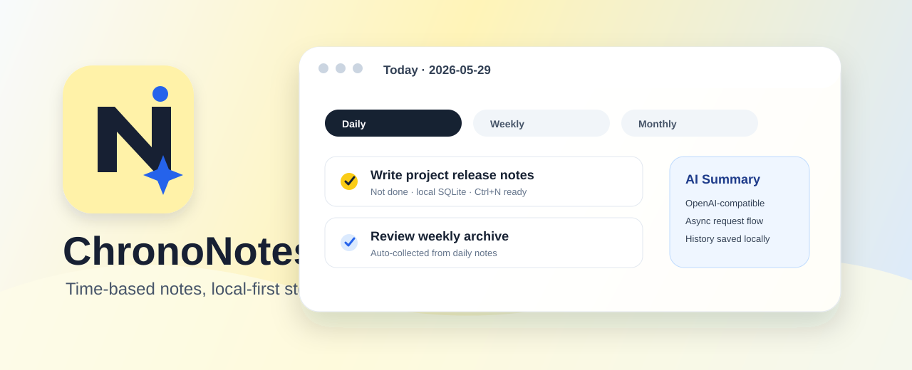
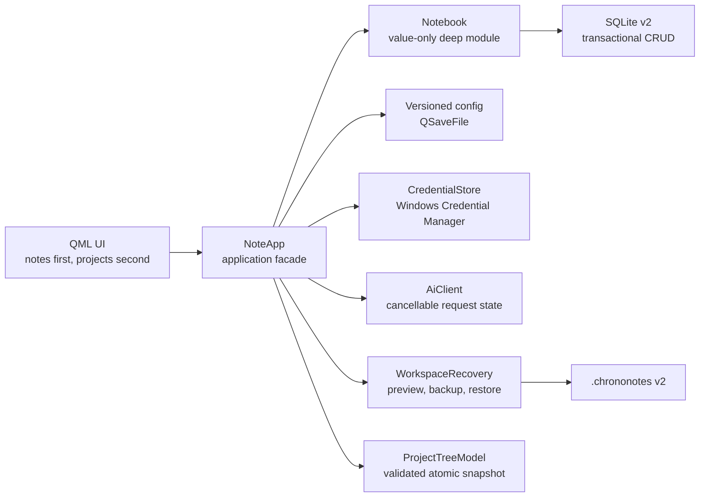

<p align="center">
  
</p>

<h1 align="center">ChronoNotes</h1>

<p align="center">
  A lightweight, local-first Windows notebook for time-based notes,
  project thinking, and private AI-assisted summaries.
</p>

<p align="center">
  
  
  
  
  
</p>

---

ChronoNotes 是一款基于 Qt 6 Quick/QML 与 C++17 的 Windows 11
桌面应用。产品结构坚持“便签主、项目辅”：日常记录保持足够快，
项目树负责补充上下文，AI 摘要只处理用户明确选择的本地快照。

它不是多人协作平台，也不试图复制 Notion 或 Jira。核心目标只有四个：
好用、好看、轻量、可靠。

## 核心能力

| 方向 | 说明 |
| --- | --- |
| 时间阶段 | 以每天、每周、每月、每年组织便签，支持跨阶段搜索与聚合回顾。 |
| 稳定任务 | 支持新增、编辑、完成、删除、批量处理、短时撤销和稳定重复任务系列。 |
| 项目辅助 | 使用可校验、可持久化的项目树记录项目、任务、描述和祖先路径。 |
| 本地优先 | SQLite、配置、备份、摘要历史和诊断文件默认全部留在本机。 |
| 安全 AI | API Key 仅保存在 Windows Credential Manager；默认只允许 HTTPS。 |
| 可恢复 | `.chrononotes` v2 工作区备份包含便签、项目树、摘要历史与非敏感偏好。 |
| 可迁移 | 兼容旧 JSON v1、旧文本便签数据与 Markdown 导出。 |
| 无障碍 | 提供键盘导航、焦点环、语义名称、减少动画与高 DPI 支持。 |

## 界面与交互

- 原生 Windows 11 标题栏保留 Snap、系统菜单和辅助技术兼容性。
- 内容区使用暖象牙画布、纸张表面、墨色正文、琥珀主强调与鼠尾草项目色。
- 时间阶段使用低权重文字导航；批量完成收在“批量”菜单中。
- 项目树、AI 与设置面板通过 `Loader` 按需创建。
- 覆盖首次启动、空数据、无搜索结果、AI 未配置/运行/失败、
  非法导入、只读恢复和未选择项目等状态。

## 架构


```mermaid
flowchart LR
  UI["QML UI<br/>notes first, projects second"] --> App["NoteApp<br/>application facade"]
  App --> Notebook["Notebook<br/>value-only deep module"]
  App --> Config["Versioned config<br/>QSaveFile"]
  App --> Credentials["CredentialStore<br/>Windows Credential Manager"]
  App --> AI["AiClient<br/>cancellable request state"]
  App --> Recovery["WorkspaceRecovery<br/>preview, backup, restore"]
  App --> Tree["ProjectTreeModel<br/>validated atomic snapshot"]
  Notebook --> SQLite["SQLite v2<br/>transactional CRUD"]
  Recovery --> Workspace[".chrononotes v2"]
```

| 模块 | 职责 |
| --- | --- |
| `src/qt_note_app.*` | 面向 QML 的应用门面、视图投影、撤销与 AI 请求状态。 |
| `src/notebook.*` | 隐藏 SQLite、容器、排序和迁移实现，只暴露 `QString` 值对象与明确错误。 |
| `src/note_store.*` | Notebook 内部使用的旧数据适配与 SQLite 迁移实现。 |
| `src/config.*` | 版本化非敏感设置、字段校验与原子保存。 |
| `src/credential_store.*` | API Key 的 Windows 凭据库读写与旧明文迁移。 |
| `src/ai_client.*` | HTTPS 策略、超时、取消、响应上限与敏感错误脱敏。 |
| `src/workspace_recovery.*` | 工作区预览、危险操作前备份、恢复、保留策略与诊断导出。 |
| `src/backup_service.*` | `.chrononotes` v2、JSON v1 与 Markdown 编解码。 |
| `src/project_tree_model.*` | 循环/孤儿/重复 ID 校验、缓存统计、选择状态与原子保存。 |
| `src/local_profile.*` | 安装、便携、测试覆盖路径与旧数据只复制迁移。 |
| `src/clock.*` | 生产时钟与可注入测试时钟。 |

## 数据规则

数据目录按以下优先级解析：

1. 测试或开发覆盖变量 `STICKY_NOTES_DATA_DIR`。
2. 程序旁存在 `portable.flag` 时，使用程序旁 `data/`。
3. 其他情况使用 `QStandardPaths::AppLocalDataLocation`。

旧目录迁移只复制并验证，不删除原文件。核心文件包括：

```text
notes.sqlite
config.ini
project_tree.json
summary-history.md
operations.jsonl
backups/
```

- 便签正文使用 SQLite `TEXT`，严格限制为 65,536 个字符；超限失败且不截断。
- 重复任务使用稳定 `series_id`，完成、派生下一项与撤销逆操作均在事务中完成。
- `config.ini` 只保存非敏感偏好；API Key 不会写入配置或工作区备份。
- 操作日志不保存便签正文、项目描述、AI 内容或 API Key。
- 自动备份保留 7 个每日备份、3 个危险操作前备份，总量不超过 200 MiB。

## 构建

### 环境

- Windows 11
- Qt 6.8.3 MinGW
- CMake 4.0+
- 支持 C++17 的 MinGW 工具链

仓库默认查找：

```text
third_party/Qt/6.8.3/mingw_64
```

推荐使用统一入口；脚本会发现 Qt、MinGW 与 CLion 附带的 CMake，并把临时目录
固定在被 Git 忽略的构建目录中：

```powershell
powershell -NoProfile -ExecutionPolicy Bypass -File tools/build.ps1 `
  -Configuration Debug -BuildDir cmake-build-debug -RunTests

powershell -NoProfile -ExecutionPolicy Bypass -File tools/build.ps1 `
  -Configuration Release -BuildDir cmake-build-release -Clean -RunTests
```

也可以手动配置：

```powershell
cmake -S . -B build -G "MinGW Makefiles" `
  -DCMAKE_PREFIX_PATH="<qt-mingw-path>"
cmake --build build -j 6
ctest --test-dir build --output-on-failure
```

运行：

```powershell
.\build\ChronoNotes.exe
```

## 测试

CTest 当前注册 10 组测试：

| 测试 | 主要覆盖 |
| --- | --- |
| `note_store_tests` | 旧数据适配、SQLite schema 与迁移。 |
| `notebook_tests` | 事务 CRUD、回滚、锁库、只读、损坏库、磁盘满、长文本与性能。 |
| `note_view_tests` | 阶段投影、搜索、筛选与归档。 |
| `project_tree_model_tests` | 结构校验、选择、祖先路径、缓存统计与 5,000 节点操作。 |
| `config_tests` | 版本化配置、原子保存、明文 Key 迁移字段与未来版本保护。 |
| `ai_client_tests` | HTTPS、localhost 例外、取消、超时、大小限制与脱敏。 |
| `backup_service_tests` | JSON v1、工作区 v2、非法输入和敏感字段排除。 |
| `workspace_recovery_tests` | 预览、危险操作前备份、恢复回滚、保留策略与诊断。 |
| `qt_note_app_tests` | 业务流程、跨日期时钟、撤销、AI 乱序与工作区事务。 |
| `qml_interaction_tests` | UI 状态、键盘目标、焦点、无障碍与视觉令牌。 |

QML 静态检查：

```powershell
cmake --build build --target all_qmllint -j 6
```

提交前至少运行 Debug/Release、全部 CTest、`all_qmllint` 与：

```powershell
git diff --check
```

## 恢复中心

设置面板中的恢复中心支持：

- 创建工作区备份。
- 预览 `.chrononotes` 导入影响。
- 恢复自动备份或危险操作前备份。
- 导入/导出工作区、JSON v1 与 Markdown。
- 打开数据目录。
- 导出不含正文、AI 内容和 API Key 的脱敏诊断。

导入流程必须先完整解析和严格校验，再创建危险操作前备份，最后提交；
任一步失败都会恢复原便签、偏好与摘要历史。

## AI 配置与隐私

使用 AI 摘要前，在设置中填写：

- HTTPS API URL。
- API Key。
- OpenAI-compatible 模型名称。

远程 HTTP 永远拒绝；只有用户显式启用后才允许
`localhost`、`127.0.0.1`、`::1` 或 `*.localhost` 使用 HTTP。
单次请求可取消，默认 45 秒超时；旧请求完成晚于新请求时，其结果会被丢弃。

请勿把 API Key、运行数据库、诊断日志、构建目录或个人 Qt SDK 提交到仓库。

## 可选发布工程

仓库包含 NSIS 安装包、便携 ZIP、SHA-256、CycloneDX/SPDX SBOM、
第三方声明和签名钩子的工程配置。没有签名证书时只会生成 `candidate`，
不会伪装成正式发布。

```powershell
powershell -NoProfile -ExecutionPolicy Bypass -File tools/package_release.ps1 `
  -BuildDir cmake-build-release -OutputDir dist
```

这一步不是本地开发或提交源码的前置条件。

## 明确不做

当前范围不包含暗色主题、账号、云同步、日历、提醒、自动更新、遥测和多人协作。

## 许可

本项目使用 [PolyForm Noncommercial License 1.0.0](LICENSE)。
商业使用不在该许可范围内，请在公司内部工具、付费产品或商业交付前确认许可边界。
